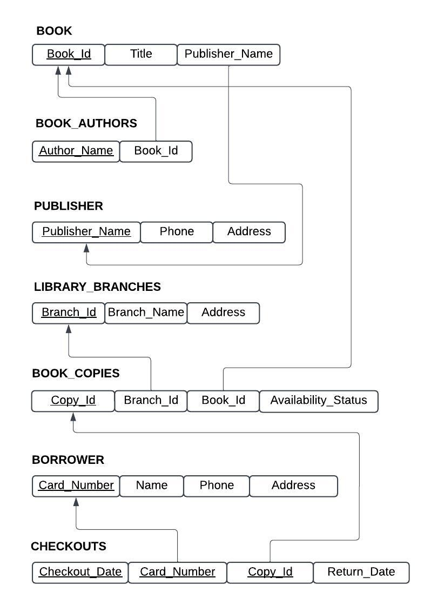
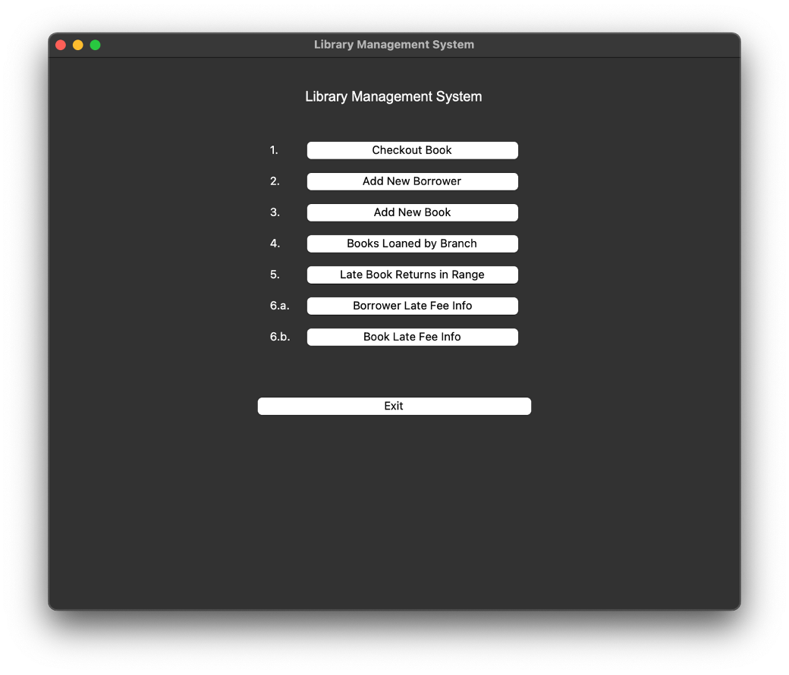
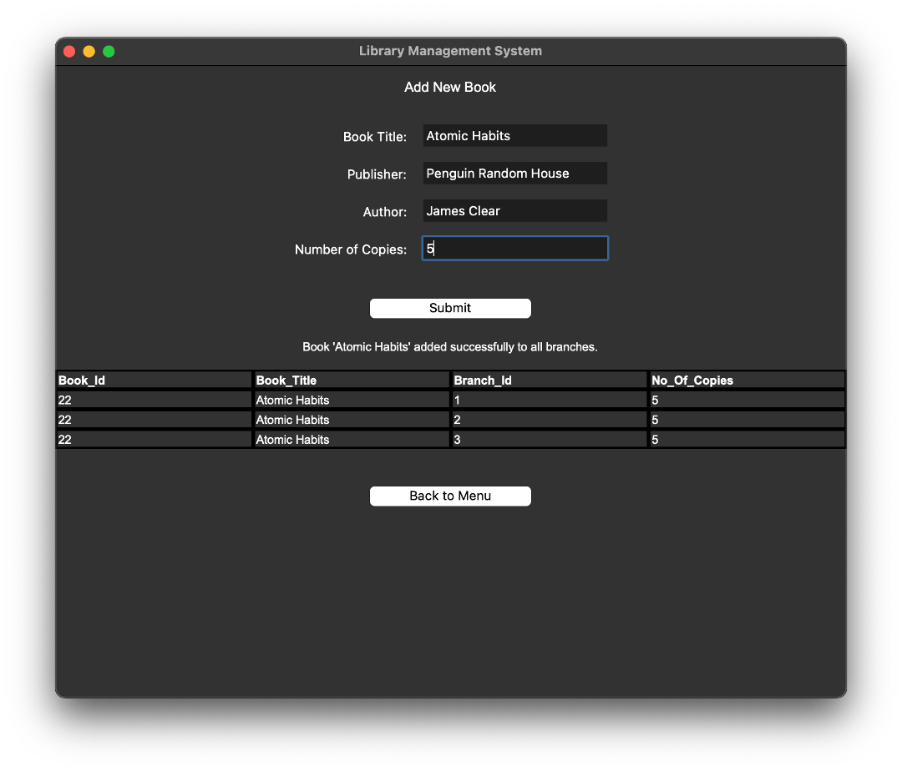
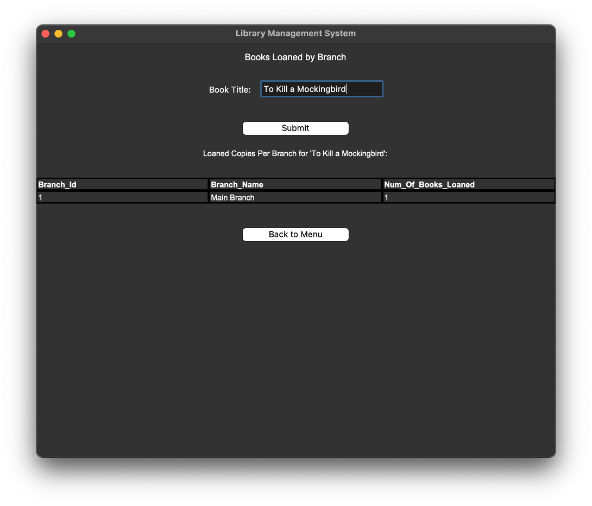
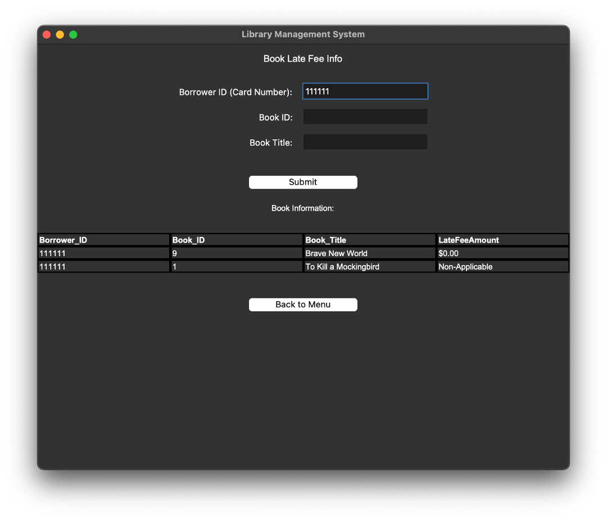
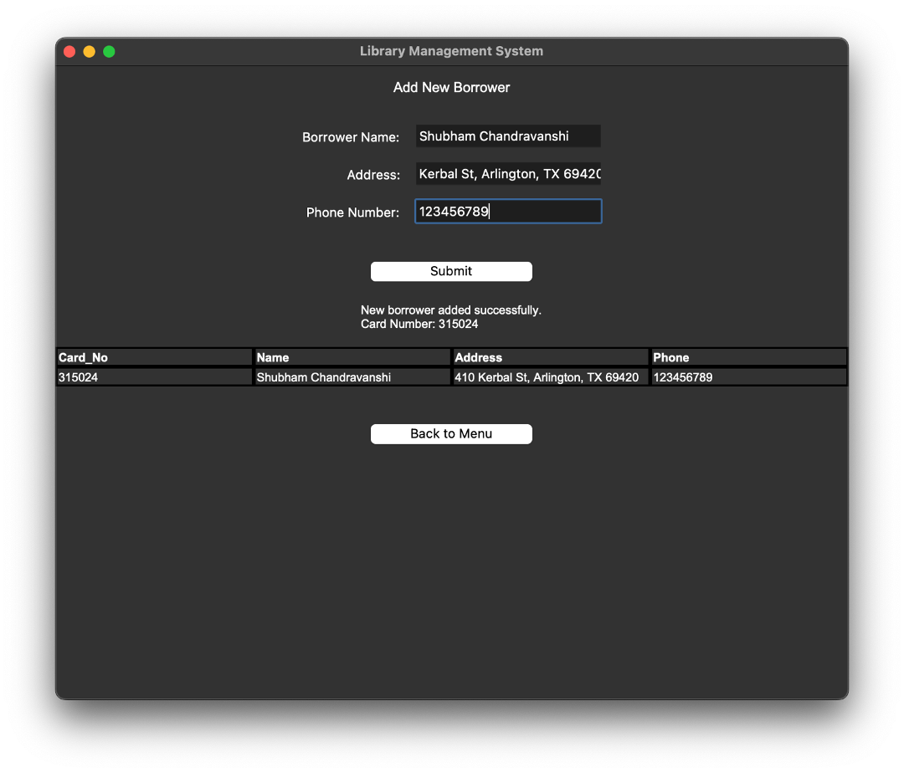
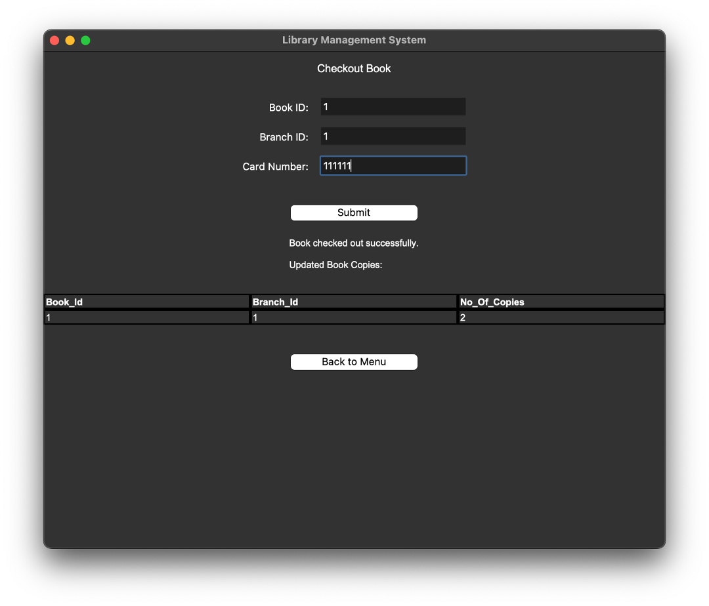
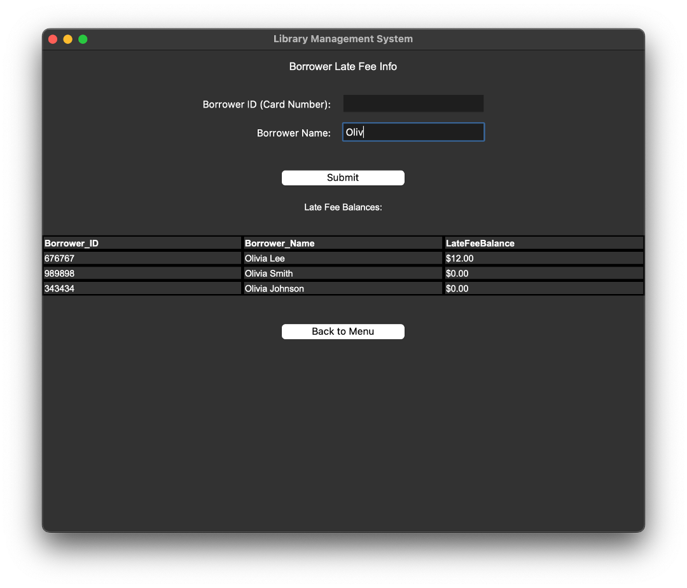
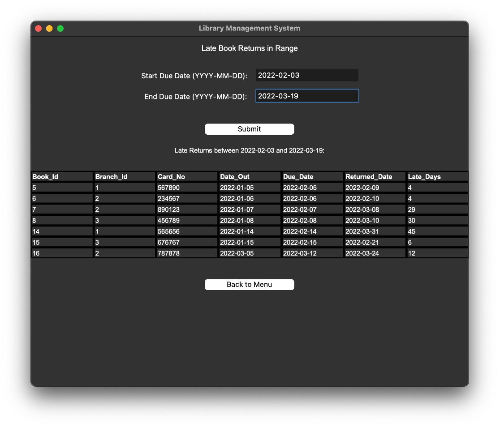

# Library Management System (CSE 3330: Project 2)

This Library Management System is the final project for The University of Texas at Arlington's CSE 3330 (Database Systems &amp; File Structures) class.

## Project Overview
This comprehensive Library Management System is the final project for UTA's CSE-3330 (Database Systems &amp; File Structures) class. This project implements a complete database solution with a graphical user interface, allowing librarians to manage books, borrowers, and loans efficiently.

## Features
- **Book Management**
  - Add new books with publisher and author information
  - Automatically distribute copies across library branches
  - Track book availability across different branches

- **Borrower Management**
  - Register new borrowers with automatic card number generation
  - Maintain borrower contact information
  - Track borrowing history and late fees

- **Loan Management**
  - Check out books with automatic due date assignment
  - Track book returns and calculate late fees
  - Monitor overdue books and generate reports
  - Automatically update book copy availability

## Technologies Used
- **Python**: Core programming language
- **Tkinter**: GUI framework
- **SQLite3**: Database management
- **SQL**: Database queries and management

## Relational Database Schema


## App Demo

### Main Menu


### Book Management




### Borrower Management





## Installation & Setup

1. Clone the repository:
```bash
git clone https://github.com/shubhamctech/LibraryManagementSystem.git
```

2. Install dependencies:
```bash
pip install tkinter sqlite3
```

3. Run the application:
```bash
python LMSApp.py
```

## Project Structure
- `LMSApp.py`: Main application file with GUI implementation
- `LMSSQL`: Folder for SQL files for database schema creation, import & other queries
- `LMSDataset`: Folder containing .csv files provided as sample dataset

## Team Members
This project was developed as the final project for CSE 3330. While I led the development of the GUI application and database integration, valuable contributions were made by team members:
- Jeffery Aguirre
- Sallah Al-Ali
- Shubham Chandravanshi (GUI Development & Database Integration)

## Contact
If you have any questions or feedback about this project, feel free to reach out:
- **Email**: [shubhamc4tech@gmail.com](mailto:shubhamc4tech@gmail.com)
- **LinkedIn**: [linkedin.com/in/shubhamctech](https://linkedin.com/in/shubhamctech)

#### Thanks for visiting my project!
