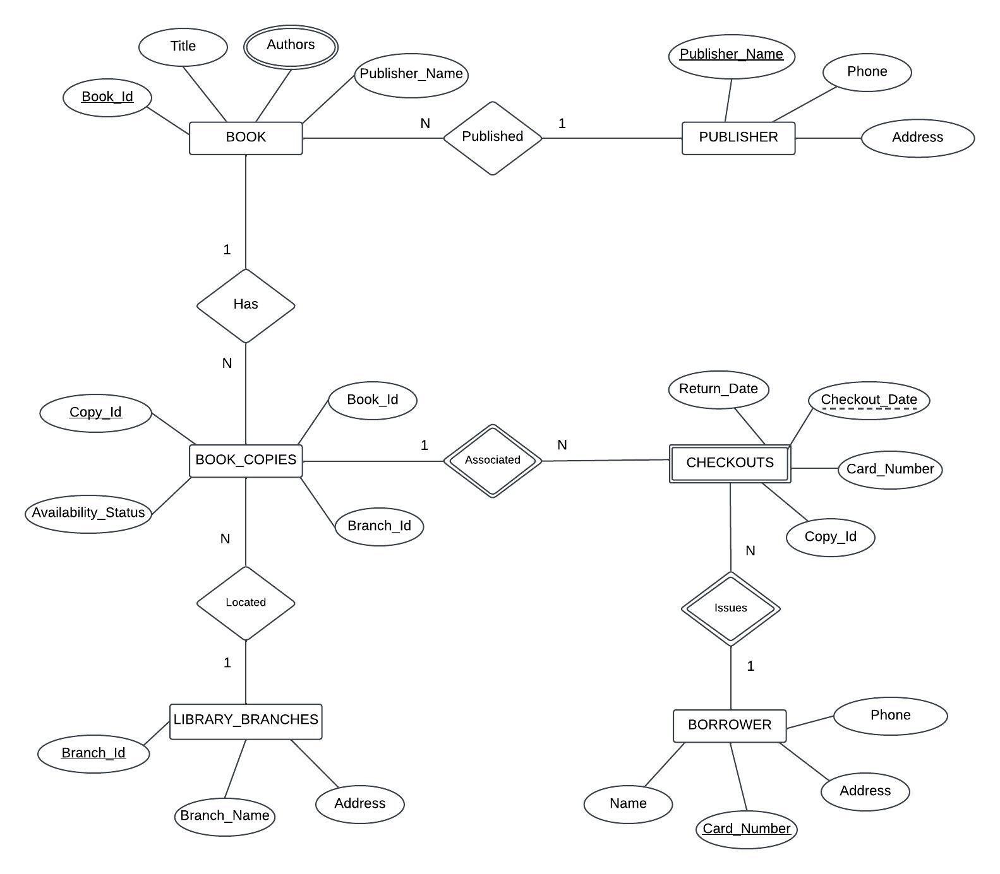
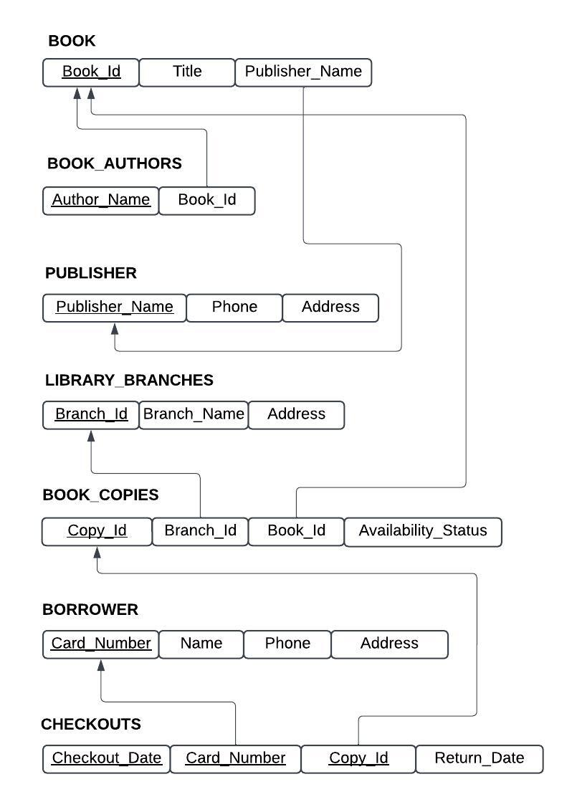

# LibraryManagementSystem
Library Management System final project for CSE 3330 (Database Systems &amp; File Structures) class.

## Features
- Track books, authors, publishers, and library branches.
- Manage multiple copies of books across different branches.
- Handle borrower details and checkouts with return dates.

## ER Diagram

## Relational Database Schema

This diagram shows the relational database schema mapped from the ER diagram, detailing the tables, primary keys, and relationships between entities.*
